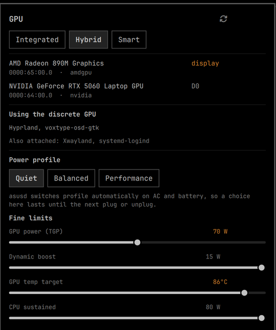

# GPU — hybrid graphics control for the Omarchy bar

Switch your laptop's GPU mode, see the discrete card's **real PCI power state**, and — the
reason this exists — find out **which processes are keeping it awake**.

On ASUS ROG hardware it also exposes the platform profile and the firmware power envelope.



## Is this for you?

This plugin is for **laptops with switchable hybrid graphics** — an integrated GPU that drives
the display plus a discrete GPU used for offload. Typically an AMD or Intel iGPU alongside an
NVIDIA dGPU.

| Requirement | Why |
|---|---|
| **Hybrid GPU laptop** | On a single-GPU machine there is nothing to switch |
| **[cardwire](https://github.com/OpenGamingCollective/cardwire)** daemon | Does the actual GPU management; this is a front-end for it |
| **Wayland** | cardwire does not support X11 |
| Kernel with `CONFIG_BPF_LSM` | cardwire blocks GPUs with eBPF LSM hooks |
| *(optional)* **asusd** from [asusctl](https://asus-linux.org) | Adds the ASUS power-profile and limits section |

The ASUS section **hides itself completely** when asusd is absent, so the plugin is useful on any
hybrid laptop — you simply get the mode switching and power-state half.

Developed and tested on an **ASUS ROG Zephyrus G14 (GA403WM, 2025)** — Radeon 890M driving the
display, RTX 5060 as offload — on Omarchy 4 / Arch.

## Installing cardwire on Arch

**The AUR `cardwire` package currently cannot build on Arch.** Not a packaging mistake on the
maintainer's part — an LLVM version mismatch:

- The eBPF crate is compiled by a pinned Rust nightly whose LLVM emits current-trunk bitcode.
- `bpf-linker` then has to lower that bitcode, and Arch's `bpf-linker` links against the distro
  `llvm-libs`, which is a release behind.
- The result is `A call to built-in function 'memset' is not supported`, or with a newer nightly,
  `LLVM ERROR: Invalid record`.

Upstream documents this in `crates/cardwire-ebpf-userspace/build.rs`: *"Distro bpf-linkers linked
against a stable llvm cannot lower trunk bitcode no matter which nightly is pinned here."*
Building `bpf-linker` yourself does not help, because `cargo install` picks up the same system
LLVM.

**Use upstream's prebuilt Arch package instead** — they publish one with every release:

```bash
gh release download --repo OpenGamingCollective/cardwire \
  --pattern 'cardwire-*-x86_64.pkg.tar.zst'
sudo pacman -U cardwire-*-x86_64.pkg.tar.zst
sudo systemctl enable --now cardwired
```

(Or download the `.pkg.tar.zst` from the [releases page](https://github.com/OpenGamingCollective/cardwire/releases) by hand.)

Worth knowing before you enable it at boot: cardwire's `AutoApplyGpuState` defaults to **true**,
which re-applies the last saved mode when the daemon starts — before you have a session to
correct it from. Consider turning it off:

```bash
busctl --system set-property org.opengamingcollective.cardwire \
  /org/opengamingcollective/cardwire \
  org.opengamingcollective.cardwire.Config AutoApplyGpuState b false
```

## Installing the plugin

```bash
omarchy plugin add https://github.com/rawritude/omarchy-gpu.git --enable
omarchy bar move gpu --section right
```

Plugins land disabled unless you pass `--enable`, so you can read the code first.

## Usage

**Bar:** the icon shows the discrete GPU's state — its PCI D-state when awake, `off` when
blocked, `auto` in Smart mode. It highlights when the card is out of a low-power state, which is
the "something woke my dGPU" signal. Click to open the panel.

**Modes:**

- **Integrated** — the dGPU is blocked outright. Lowest power.
- **Hybrid** — both GPUs available; the dGPU parks itself when idle.
- **Smart** — blocked by default, with per-process exceptions. cardwire watches every `exec` and
  allows processes carrying `CARDWIRE_ALLOW=1`, `CARDWIRE_FORCE_DGPU=1`, or a `SteamAppId`.

To give a program access under Smart, set the variable wherever it launches. For a systemd user
service:

```ini
# ~/.config/systemd/user/<app>.service.d/cardwire.conf
[Service]
Environment=CARDWIRE_ALLOW=1
```

**Keys in the panel:** `i` integrated · `h` hybrid · `s` smart · `r` refresh · `esc` close.

**IPC**, for keybinds:

```bash
omarchy-shell gpu toggle
omarchy-shell gpu integrated
omarchy-shell gpu hybrid
omarchy-shell gpu smart
```

## Settings

| Key | Default | Meaning |
|---|---|---|
| `fallbackPollMs` | `300000` | Safety-net refresh; updates normally arrive by D-Bus signal |
| `activePollMs` | `3000` | Refresh while the panel is open (the process list has no signal behind it) |
| `warnWhenAwake` | `true` | Highlight the bar icon when the dGPU is not in a low-power state |

Set with `omarchy bar set gpu <key> <value> --json` (pass `--json` for booleans and numbers,
otherwise they are stored as strings).

## Notes on the ASUS section

The power limits are only writable if asusd's per-profile *tunings* are enabled in
`/etc/asusd/asusd.ron` — they ship disabled. The panel tells you when writes are being ignored
rather than letting a slider spring back unexplained.

On **asusd 6.3.8** the limits are effectively read-only regardless: that release has a
getter/setter bug where property writes are accepted and silently discarded (the same defect that
breaks `asusctl slash --mode`). It needs ≥ 6.4.0. The **profile buttons work regardless** — they
apply the tuning groups from `asusd.ron`, which is how to set custom limits on that version.

Two behaviours worth knowing, both asusd's rather than this plugin's:

- If asusd is configured to switch profiles on AC/battery, a profile you pick by hand lasts only
  until the next plug or unplug. The panel says so when that is configured.
- **Reset-to-defaults also overwrites the active profile's saved group**, because asusd persists
  its tuning state back to the config file. The button says this; the tooltip spells it out.

## Design notes

**Nothing here wakes the discrete GPU.** `nvidia-smi` and `lspci` both resume a runtime-suspended
card simply by being run — so a naive monitor causes the very problem it reports. Power state comes
from cardwire's `PowerState()` D-Bus method, which the daemon answers without touching the device.

**Reads come from sysfs, not asusd's D-Bus properties.** With tunings disabled, asusd's
`CurrentValue` reports what was *requested*, not what the hardware has — it will happily claim
70 W while the GPU sits at 85 W. Every attribute is read from
`/sys/class/firmware-attributes/asus-armoury/` via `FileView`: authoritative, natively watched, and
no subprocess.

**Updates are event-driven.** cardwire and asusd both emit `PropertiesChanged`; a `gdbus monitor`
process sits blocked on a socket and the widget reacts only to real changes. An earlier polling
version cost ~480 process spawns and ~1.5 MB of journal per hour. A closed panel now does no
periodic work at all beyond a five-minute safety net.

**`blocked` does not mean unusable.** Smart mode reports `blocked=true` because it blocks *by
default* and then allows individual processes. Anything reasoning about whether the dGPU is
usable keys off the mode, never that flag.

## Credits

This plugin is a front-end. The hard parts belong to other people:

- **[cardwire](https://github.com/OpenGamingCollective/cardwire)** by the
  [Open Gaming Collective](https://github.com/OpenGamingCollective) (GPL-3.0) — the eBPF LSM GPU
  manager that does all the actual switching, blocking and per-process policy. Everything in the
  top half of this panel is a view onto their daemon.
- **[asusctl / asusd](https://asus-linux.org)** by Luke Jones and the
  [asus-linux](https://asus-linux.org) project (MPL-2.0) — the `xyz.ljones.AsusArmoury` interface
  and the platform-profile handling behind the ASUS section.
- **[Omarchy](https://github.com/basecamp/omarchy)** by Basecamp (MIT) — the shell, its plugin
  system, and the `Ui` components (`ButtonGroup`, `PanelSlider`, `PanelActionButton`,
  `KeyboardPanel`) this plugin is built from. The first-party `power` and `tailscale` panels were
  the working reference for how a bar widget should behave.
- **[Quickshell](https://git.outfoxxed.me/quickshell/quickshell)** by outfoxxed (LGPL-3.0) — the
  QML shell framework underneath all of it.
- **[omarchy-asus-master](https://github.com/remydw/omarchy-asus-master)** by remydw (MIT) — the
  first plugin to drive asusd from Quickshell, and the reference for the asusd D-Bus call shapes
  and the `QueuedGpuValue` / `ApplyQueuedGpuValue` flow. No code is shared, but the interface
  knowledge came from reading it.
- **[Nerd Fonts](https://www.nerdfonts.com/)** — the glyphs.

## License

MIT — see [LICENSE](LICENSE).
